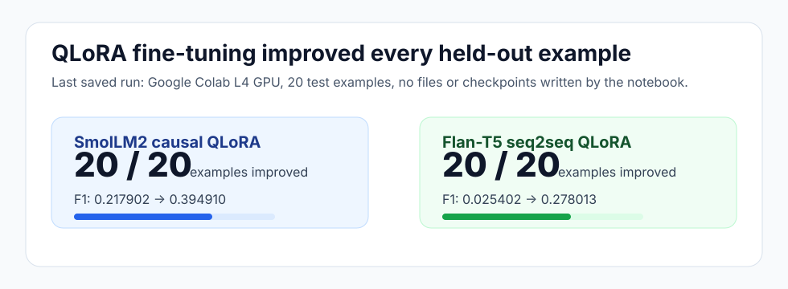
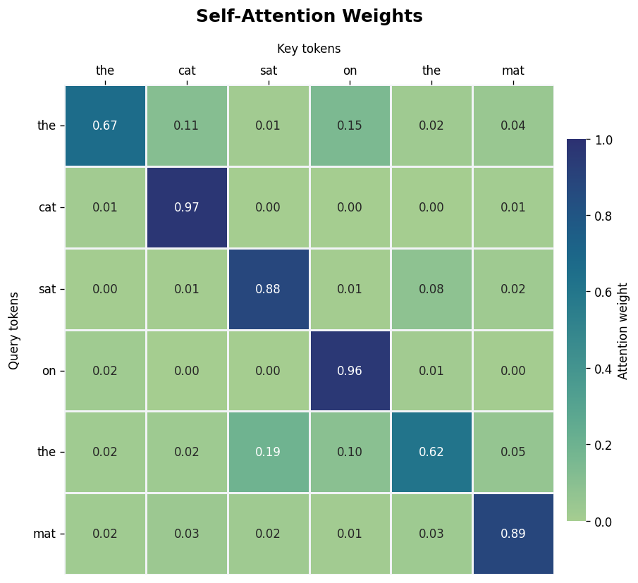
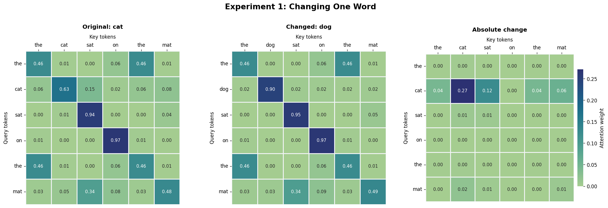
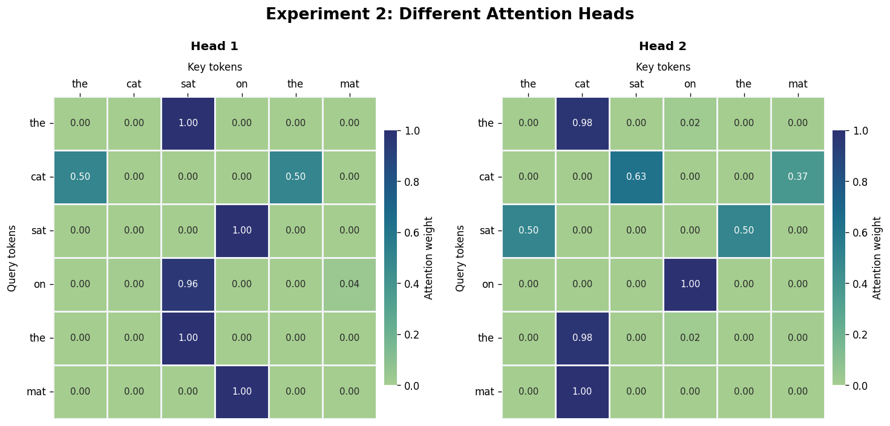

# From Fine-Tuning to Attention Inside LLMs


Assignment 3 notebook for studying two core LLM mechanics:

- QLoRA fine-tuning for level-adaptive question answering.
- Scaled dot-product attention and multi-head attention visualization.

The notebook keeps datasets, metrics, plots, and model outputs inside notebook cells.
It does not write result files or checkpoints during execution.

## At A Glance

| Area | Details |
|---|---|
| Notebook | `From_Finetuning_to_Attention_Inside_LLMs.ipynb` |
| Models | `HuggingFaceTB/SmolLM2-360M-Instruct`, `google/flan-t5-small` |
| Dataset source | `databricks/databricks-dolly-15k` |
| Training method | 4-bit QLoRA with LoRA adapters |
| Last runtime | Google Colab L4 GPU |
| License | MIT |

## Results

The last saved run used CUDA / 4-bit QLoRA with 900 training examples, 810 fitting
records, 90 validation records, and 20 held-out test examples.

| Model | Base F1 | Fine-tuned F1 | Improved examples | F1 delta |
|---|---:|---:|---:|---:|
| SmolLM2 causal QLoRA | `0.217902` | `0.394910` | `20 / 20` | `+0.177009` |
| Flan-T5 seq2seq QLoRA | `0.025402` | `0.278013` | `20 / 20` | `+0.252611` |



## Main Findings

- Fine-tuning improved both models on every held-out test example by word-overlap F1.
- SmolLM2 produced the stronger final answers overall, with better level control,
  lower repetition, perfect prefix following, and a higher quality score.
- Flan-T5 improved more in absolute delta because its base outputs were weaker, but
  its final outputs were still less controlled than SmolLM2.
- The richer evaluation found no saved held-out example where fine-tuning reduced F1.
- QLoRA made the experiment practical in Colab by quantizing the frozen base model
  and training only small adapter matrices.
- In the attention section, changing `cat` to `dog` changed attention because the
  token embedding changed the query-key dot products.
  The saved run reported mean absolute attention difference `0.0172` and maximum
  difference `0.2715`.
- Different attention heads focused on different tokens, showing how multi-head
  attention captures multiple relationships in parallel.

## Notebook Visuals

The README includes selected visuals extracted from the executed notebook outputs.

### Attention Heatmap



### Changing One Word



### Different Attention Heads



## Project Files

| Path | Purpose |
|---|---|
| `From_Finetuning_to_Attention_Inside_LLMs.ipynb` | Fully executed assignment notebook |
| `setup_and_run_notebook.sh` | Creates the environment and executes the notebook |
| `assets/` | README images exported from notebook outputs |
| `.env.template` | Template for local Hugging Face token configuration |
| `LICENSE` | MIT license |

## Quick Start

Copy the current environment template and rename the copy to `.env`:

```bash
cp .env.template .env
```

Open `.env` and fill it with the relevant values for your run.
At minimum, replace the placeholder Hugging Face token:

```bash
HF_TOKEN=YOUR_HUGGING_FACE_TOKEN
```

Run the setup script:

```bash
bash setup_and_run_notebook.sh
```

The script checks for Python, creates `.venv`, installs notebook dependencies,
registers the virtual environment as a Jupyter kernel, loads `.env`, and executes
the notebook in place with `nbconvert`.

## Manual Local Setup

```bash
python -m venv .venv
source .venv/bin/activate
python -m pip install --upgrade pip notebook
set -a
source .env
set +a
jupyter notebook
```

## Colab Notes

For the full target-model run, use a GPU runtime.
The saved successful run used an L4 GPU.

The notebook removes an incompatible preinstalled `torchao` package when needed,
then installs only the packages required for the assignment.

Keep the Hugging Face token outside version control.
Use `.env` locally or a Colab secret/environment variable named `HF_TOKEN`.

## Reproducibility Notes

- The 20-example test set is held out from training and validation.
- Training, validation, evaluation, and generalization tables are displayed as
  DataFrames inside the notebook.
- Adapters are kept in memory during execution.
- No external result files, datasets, model weights, or checkpoints are written.

## License

This project is licensed under the MIT License.
See `LICENSE` for details.
